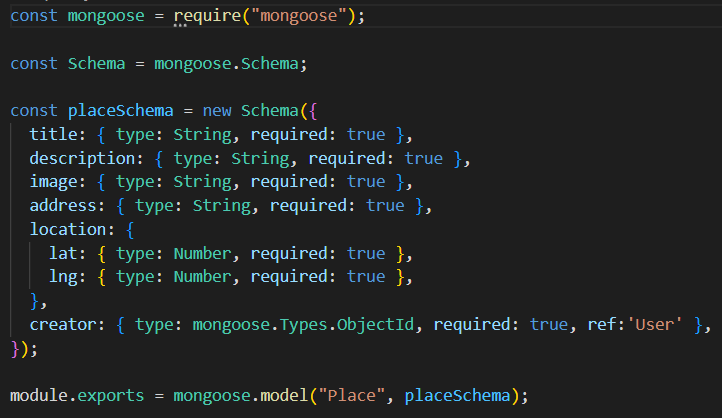

# uploadStore

UploadStore is an app for people to upload and store images of their favourite moments or places.

## Description

The objective of creating this app is to understand how to create an uploading feature, to upload images and possibly videos in the future. The app allows people to view the moments/places of other people on the app and upload their own images.

## Technical Used

MERN (Mongo, Express, React, Node)

FrontEnd

- React, React Router Dom5, JavaScript.

BackEnd

- Express, NodeJS, MongoAtlas, Mongoose, UUID, Express-Validator, Multer

## WireFrame/FlowChart

FrontEnd

- LoggedIn FlowChart
  

- NotLoggedIn FlowChart
  

BackEnd

- PlaceSchema
  

- UserSchema
  

## User Stories

User must be able to:

- Login in order to upload pictures of the place they want to store.
- View the stored places/images and edit or delete the place as they wish
- Allow others to view the images and stored information.

## Planning and development process

I had to research for a way to upload and came across multer as a library to manage uploads. Followed a tutorial on multer and had to also recap on JWT login through another youtube tutorial in order to develop the app.

## Unsolved problems

Adding video upload feature in the future.
